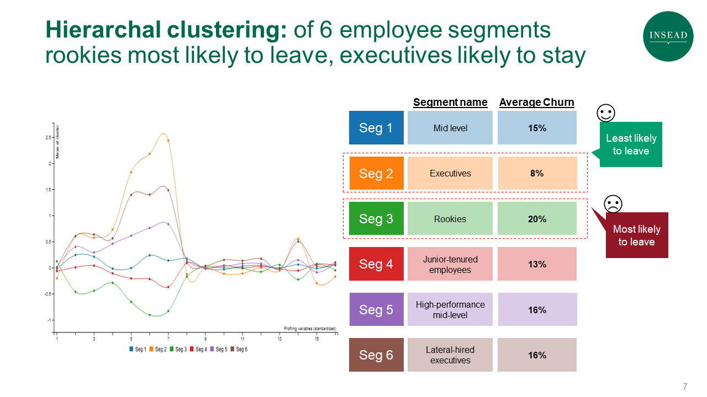
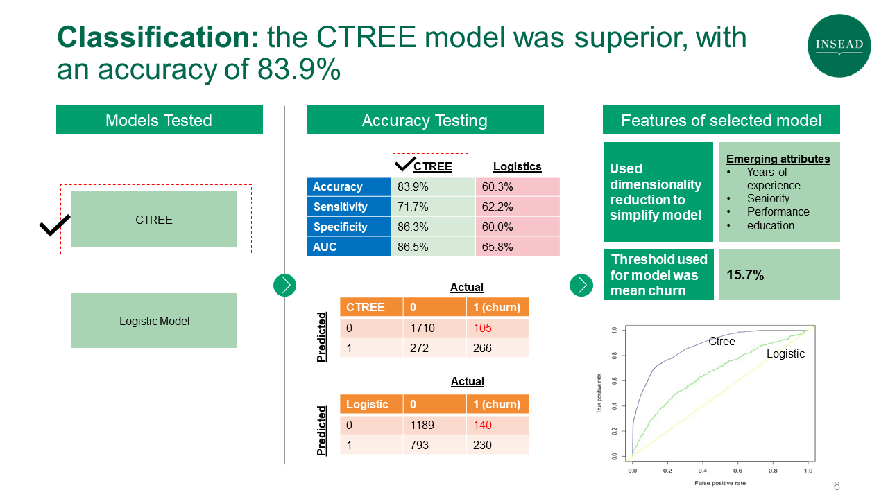

---
title: "Predicting Employee Retention at IBM"
author: "20J Group 8: Joe Yoo, Martin Febrian, Jessie Serrino, Aisling Grogan, Antoine Joan, Magno Guidote"
output:
  html_document:
    css: C:/Users/antoi/OneDrive/Documents/R/INSEADAnalytics/AnalyticsStyles/default.css
    theme: paper
    toc: yes
    toc_float:
      collapsed: no
      smooth_scroll: yes
  pdf_document:
    includes:
      in_header: C:/Users/antoi/OneDrive/Documents/R/INSEADAnalytics/AnalyticsStyles/default.sty
always_allow_html: yes
---

# Business Problem

Employee churn is a problem that many firms face. In the US, firms face an average churn of about 10%-15%, and this churn can prove costly. It is estimated that an unwanted departure of an employee can cost the firm anywhere from 30% (of his/her annual salary) for more junior employees to 400% for much more senior employees. The difficulty of finding a replacement and bringing that replacement to the same level of productivity, the lost knowledge and know-how, and the period where resources have to carry the extra load of a missing colleague can be serious problems, especially for firms that face a higher rate of attrition. As such, many firms are trying to solve this issue, and have put in place more measures to boost employee retention such as training programmes, career progression and the promise of better work life balance.

The arrival of data science can help predict the probability of employee churn and help alleviate this problem. In fact, in the last couple of years, IBM has built algorithms that helps predict the likelihood of its employees leaving. The company claims that it has reached 95% level of accuracy, and has clocked retention cost savings to the tune of $300 million. Coupled with other data science tools that help keep employees more committed to their job (eg. by giving more fair compensation, providing internal movement opportunities), IBM is leading the way in employee retention through data science. 

Since many of us faced and will face employee churn, our group believes that learning how an employee churn model works, and the business insights and actions we can glean from it would be very useful. Thus we decided to create our own employee churn model, albeit with IBM data, given the availability of this data online. What we hope to achieve is an understanding of the drivers of churn, the consequent actions businesses would take, as well as the know-how of building such a model, which we can replicate in the future for our own companies.

<hr>\clearpage

> ** The Process **
>
Part 1: Approach & Analysis
>
Part 2: Business Insights
>
Part 3: Strategy & Recommendations

Intro code

```{r setuplibraries, echo=FALSE, message=FALSE}

suppressWarnings(source("library.R"))
# Package options
suppressWarnings(ggthemr('fresh'))  # ggplot theme
opts_knit$set(progress=FALSE, verbose=FALSE)
opts_chunk$set(echo=FALSE, fig.align="center", fig.width=10, fig.height=6.35, results="asis")
options(knitr.kable.NA = '')

source("team_helper_functions.r")

ProjectData <- read.csv("input/data.csv", na.strings=c(""," ","NA"), header=TRUE) # Loading data

```

<hr>\clearpage


# Part 1: Approach & Analysis

The list of variables we started with which was made available to us from IBM via Kaggle is presented below.


## Data Dictionary
Per the online documentation for the dataset, the definitions are as follows:


|  Name                  |    Description                                                                                                                                                                                                                                        | 
|--------------------------|------------------------------------------------------------------------------------------------------------------|                                                                                                                                                                                                                           
| Attrition                | Employment status at IBM (Possible Values: Current Employee, Voluntary Resignation, Termination)                                                                                                                                                                                       | 
| Age                      | Current age of employee (Possible Values: 18+)                                                                                                                                                                                             | 
| BusinessTravel           | How often does the employee travel for business (Possible Values: Non-Travel, Travel_Rarely, Travel_Frequently)                                                                                                                            | 
| DailyRate                | How much the employee can earn in a given day (in USD)                                                                                                                                                                                     | 
| Department               | Current department of employee (Possible Values: Human Resources, Research & Development, Sales)                                                                                                                                           | 
| DistanceFromHome         | Miles from employee's home                                                                                                                                                                                                                 | 
| Education                | Most recent degree achieved (Possible Values: 1 'Below College' 2 'College' 3 'Bachelor' 4 'Master' 5 'Doctor')                                                                                                                            | 
| EducationField           | Field of most recent study (Possible Values: Human Resources, Life Sciences, Marketing, Medical, Technical Degree, Other)                                                                                                                  | 
| EmployeeNumber           | Employee ID number                                                                                                                                                                                                                         | 
| EnvironmentSatisfaction  | Employee satisfaction with their work environment (Possible Values: 1 'Low' 2 'Medium' 3 'High' 4 'Very High')                                                                                                                             | 
| Gender                   | Gender (Male/Female)                                                                                                                                                                                                                       | 
| HourlyRate               | Current hourly rate for job in USD                                                                                                                                                                                                         | 
| JobInvolvement           | Self-rated assessment describing how involved they must be at their job (Possible Values: 1 'Low' 2 'Medium' 3 'High' 4 'Very High')                                                                                                       | 
| JobLevel                 | Current job level at the organization (out of 5) (Possible Values: 1 - Intern, 2 - Junior, 3 - Mid-Level, 4 - Senior, 5 - Director)                                                                                                        | 
| JobRole                  | Employee's current role at the company (Possible Values: Healthcare Representative, Human Resources, Laboratory Technician, Manager, Manufacturing Director, Research Director, Research Scientist, Sales Executive, Sales Representative) | 
| JobSatisfaction          | Employee rated satisfaction of job on most recent company survey (Possible Values: 1 'Low' 2 'Medium' 3 'High' 4 'Very High')                                                                                                              | 
| MaritalStatus            | Marital status (Possible Values: Single, Married, Divorced)                                                                                                                                                                                | 
| MonthlyIncome            | Most recent earned income in USD                                                                                                                                                                                                           | 
| MonthlyRate              | Current monthly rate for job in USD                                                                                                                                                                                                        | 
| NumCompaniesWorked       | Number of companies worked at before current company                                                                                                                                                                                       | 
| OverTime                 | Whether the employee must work overtime for their job (Possible Values: Yes/No)                                                                                                                                                            | 
| PercentSalaryHike        | Percent of salary raised last year                                                                                                                                                                                                         | 
| PerformanceRating        | Performance rating by manager last year (Possible Values: 1 'Low' 2 'Good' 3 'Excellent' 4 'Outstanding')                                                                                                                                  | 
| RelationshipSatisfaction | Employee satisfaction in current relationship (Possible Values: 1 'Low' 2 'Medium' 3 'High' 4 'Very High')                                                                                                                                 | 
| StockOptionLevel         | Current stock option level, out of three (Possible Values: 0 - 3)                                                                                                                                                                          | 
| TotalWorkingYears        | Number of years working overall                                                                                                                                                                                                            | 
| TrainingTimesLastYear    | Number of trainings received last year                                                                                                                                                                                                     | 
| WorkLifeBalance          | Employee's rating of their current work-life balance (Possible Values: 1 'Bad' 2 'Good' 3 'Better' 4 'Best')                                                                                                                               | 
| YearsAtCompany           | Number of years at current company                                                                                                                                                                                                         | 
| YearsInCurrentRole       | Number of years at current role at current company                                                                                                                                                                                         | 
| YearsSinceLastPromotion  | Number of years since last promoted                                                                                                                                                                                                        | 
| YearsWithCurrManager     | Number of years working with current manager                                                                                                                                                                                               | 


Just previewing the data set, we quickly noticed there was some strange data that  mathematically-created (such as daily rate that was not a consistent multiplier of monthly rate of each employee). This created a lot of issues as the data and signaled to us that the data set was flawed 

We therefore took a stance to clean a lot of the data, removing employee count, application IT, employeenumber, over 18, standard hours, as well as mathematically incorrect data such as hourly rate etc.

Some data was missing, so we replaced it by either the median (for numerical values) or “other.”

<hr>\clearpage

# Dimensionality Reduction

## Step 1: Checking the data
We then looked at all the components, and some did make sense but We checked the correlation and there were a lot of different correlations, so we could do dimensionality reduction to make it easier to explain. PCA function: we used this to determine how many components we could reduce this to reduce the number of factors. 

```{r}
ProjectData <- clean(ProjectData)
ProjectData <- data.matrix(ProjectData) 
ProjectData_INITIAL <- ProjectData

factor_attributes_used = c(2:ncol(ProjectData))
factor_attributes_used <- intersect(factor_attributes_used, 1:ncol(ProjectData))
ProjectDataFactor <- ProjectData[,factor_attributes_used]
ProjectDataFactor <- data.matrix(ProjectDataFactor)

## Steps 1-2: Check the Data 
rownames(ProjectDataFactor) <- paste0("Obs.", sprintf("%02i", 1:nrow(ProjectDataFactor)))
# print(round(my_summary(ProjectDataFactor), 2))

```


## Step 2: Check Correlations

This is where we had to take a strategic hybrid approach: the model told us we could reduce to 5 factors, but we saw that “Years in a job, years in the company, years with current manager” correlations made sense. But others did not make sense - for example Marital Status and Stock options -- so we decided to keep those factors separated. That way some factors were condensed into a factor that was meaningful while others were kept independent.


```{r}

MIN_VALUE = 0.5
correlations_thres <- round(cor(ProjectDataFactor),2)
correlations_thres[abs(correlations_thres) < MIN_VALUE]<-NA
# print(correlations_thres, scale=TRUE)

```


## Step 3: Choose Number of Factors

That way we used PCA to reduce the data from 33 to 15 factors. 

```{r}

UnRotated_Results<-principal(ProjectDataFactor, nfactors=ncol(ProjectDataFactor), rotate="none",score=TRUE)
UnRotated_Factors<-round(UnRotated_Results$loadings,2)
UnRotated_Factors<-as.data.frame(unclass(UnRotated_Factors))
colnames(UnRotated_Factors)<-paste("Comp",1:ncol(UnRotated_Factors),sep="")

# Here is how we use the `PCA` function 
Variance_Explained_Table_results<-PCA(ProjectDataFactor, graph=FALSE)
Variance_Explained_Table<-Variance_Explained_Table_results$eig
Variance_Explained_Table_copy<-Variance_Explained_Table

rownames(Variance_Explained_Table) <- paste("Component", 1:nrow(Variance_Explained_Table), sep=" ")
colnames(Variance_Explained_Table) <- c("Eigenvalue", "Pct of explained variance", "Cumulative pct of explained variance")

# print(round(Variance_Explained_Table, 2))

eigenvalues  <- Variance_Explained_Table[, "Eigenvalue"]
df           <- cbind(as.data.frame(eigenvalues), c(1:length(eigenvalues)), rep(1, length(eigenvalues)))
colnames(df) <- c("eigenvalues", "components", "abline")
iplot.df(melt(df, id="components")) ## PLOT

## Step 5: Interpret the factors
factor_selection_criterion = "manual"
manual_numb_factors_used = 6 # only used in manual case
factors_selected = manual_numb_factors_used

rotation_used = "varimax"
Rotated_Results<-principal(ProjectDataFactor, nfactors=max(factors_selected), rotate=rotation_used,score=TRUE)
Rotated_Factors<-round(Rotated_Results$loadings,2)
Rotated_Factors<-as.data.frame(unclass(Rotated_Factors))
colnames(Rotated_Factors)<-paste("Comp.",1:ncol(Rotated_Factors),sep="")

sorted_rows <- sort(Rotated_Factors[,1], decreasing = TRUE, index.return = TRUE)$ix
Rotated_Factors <- Rotated_Factors[sorted_rows,]
Rotated_Factors_thres <- Rotated_Factors
Rotated_Factors_thres[abs(Rotated_Factors_thres) < MIN_VALUE]<-NA
colnames(Rotated_Factors_thres)<- colnames(Rotated_Factors)
rownames(Rotated_Factors_thres)<- rownames(Rotated_Factors)
# print(Rotated_Factors_thres, scale=TRUE)

## Step 6:  Save factor scores 
NEW_ProjectData <- round(Rotated_Results$scores[,1:factors_selected,drop=F],2)
colnames(NEW_ProjectData)<-paste("Component(Factor)",1:ncol(NEW_ProjectData),sep=" ")

iprint.df(t(head(NEW_ProjectData, 10)), scale=TRUE)

```

<hr>\clearpage

# Segmentation




Based on the dimensionality reduction performed above, we performed clustering analysis on the data
We tried different models (hclust and kmeans), and found hclust to be the best


```{r}
# Part 2: Customer Segmentation 
ProjectData <- ProjectData_INITIAL # reset initial data

colnames <- colnames(ProjectData)
attribute_names <- c("Is_Resigning", "YearsInCurrentRole", "YearsWithCurrManager", "YearsSinceLastPromotion", "TotalWorkingYears", "JobLevel", "MonthlyIncome", "Department", "PerformanceRating", "EducationField", "DistanceFromHome", "Education", "PercentSalaryHike", "Age", "JobRole", "NumCompaniesWorked")
segmentation_attributes_used = match(attribute_names, colnames(ProjectData))
profile_attributes_used = segmentation_attributes_used
numb_clusters_used = 6

segmentation_attributes_used <- intersect(segmentation_attributes_used, 1:ncol(ProjectData))
profile_attributes_used <- intersect(profile_attributes_used, 1:ncol(ProjectData))

ProjectData_segment <- ProjectData[,segmentation_attributes_used]
ProjectData_profile <- ProjectData[,profile_attributes_used]

ProjectData_scaled <- apply(ProjectData, 2, function(r) if (sd(r)!=0) (r-mean(r))/sd(r) else 0*r)

## Step 3. Select Segmentation Variables
max_data_report = 10
profile_with = "hclust" #  "hclust" or "kmeans"
distance_used = "euclidean" # "euclidean", "maximum", "manhattan", "canberra", "binary" or "minkowski
hclust_method = "ward.D"
kmeans_method = "Lloyd" # "Hartigan-Wong", "Lloyd", "Forgy", "MacQueen").

euclidean_pairwise <- as.matrix(dist(head(ProjectData_segment, max_data_report), method="euclidean"))
euclidean_pairwise <- euclidean_pairwise*lower.tri(euclidean_pairwise) + euclidean_pairwise*diag(euclidean_pairwise) + 10e10*upper.tri(euclidean_pairwise)
euclidean_pairwise[euclidean_pairwise==10e10] <- NA
rownames(euclidean_pairwise) <- colnames(euclidean_pairwise) <- sprintf("Obs.%02d", 1:max_data_report)

Hierarchical_Cluster_distances <- dist(ProjectData_segment, method=distance_used)
Hierarchical_Cluster <- hclust(Hierarchical_Cluster_distances, method=hclust_method)

# Display dendogram
# hcd <- as.dendrogram(Hierarchical_Cluster)
# plot(hcd)
# rect.hclust(Hierarchical_Cluster, k=numb_clusters_used, border="red") 

# TODO: Draw dendogram with red borders around the 3 clusters

num <- nrow(ProjectData) - 1
df1 <- cbind(as.data.frame(Hierarchical_Cluster$height[length(Hierarchical_Cluster$height):1]), c(1:num))
colnames(df1) <- c("distances","index")
iplot.df(melt(head(df1, 30), id="index"), xlab="Number of Components", ylab = "Distances")

cluster_memberships_hclust <- as.vector(cutree(Hierarchical_Cluster, k=numb_clusters_used)) # cut tree into as many clusters as numb_clusters_used
cluster_ids_hclust=unique(cluster_memberships_hclust)

ProjectData_with_hclust_membership <- cbind(ProjectData, cluster=cluster_memberships_hclust)
hclust_data <- as.data.frame(ProjectData_with_hclust_membership)
write.csv(ProjectData_with_hclust_membership, "output/hclust.csv")
table(hclust_data$cluster, hclust_data$Is_Resigning)

kmeans_clusters <- kmeans(ProjectData_segment,centers= numb_clusters_used, iter.max=2000, algorithm=kmeans_method)
ProjectData_with_kmeans_membership <- cbind(ProjectData,cluster =kmeans_clusters$cluster)
kmeans_data <- as.data.frame(ProjectData_with_kmeans_membership)
write.csv(ProjectData_with_kmeans_membership, "output/kmeans.csv")


cluster_memberships_kmeans <- kmeans_clusters$cluster 
cluster_ids_kmeans <- unique(cluster_memberships_kmeans)

data <- read.csv("output/kmeans.csv", na.strings=c(""," ","NA"), header=TRUE) # Loading data
data <- clean(data)
desc <- describeBy(data, data$cluster, mat = TRUE)

if (profile_with == "hclust"){
  cluster_memberships <- cluster_memberships_hclust
  cluster_ids <-  cluster_ids_hclust  
}
if (profile_with == "kmeans"){
  cluster_memberships <- cluster_memberships_kmeans
  cluster_ids <-  cluster_ids_kmeans
}

# WE WILL USE THESE IN THE CLASSIFICATION PART LATER
NewData = matrix(cluster_memberships,ncol=1)
population_average = matrix(apply(ProjectData_profile, 2, mean), ncol=1)
colnames(population_average) <- "Population"
Cluster_Profile_mean <- sapply(sort(cluster_ids), function(i) apply(ProjectData_profile[(cluster_memberships==i), ], 2, mean))
if (ncol(ProjectData_profile) <2)
  Cluster_Profile_mean=t(Cluster_Profile_mean)
colnames(Cluster_Profile_mean) <- paste("Seg.", 1:length(cluster_ids), sep="")
cluster.profile <- cbind (population_average,Cluster_Profile_mean)

iprint.df(round(cluster.profile, 2))

ProjectData_scaled_profile = ProjectData_scaled[, profile_attributes_used,drop=F]

Cluster_Profile_standar_mean <- sapply(sort(cluster_ids), function(i) apply(ProjectData_scaled_profile[(cluster_memberships==i), ,drop = F], 2, mean))
if (ncol(ProjectData_scaled_profile) < 2)
  Cluster_Profile_standar_mean = t(Cluster_Profile_standar_mean)
colnames(Cluster_Profile_standar_mean) <- paste("Seg ", 1:length(cluster_ids), sep="")

iplot.df(melt(cbind.data.frame(idx=as.numeric(1:nrow(Cluster_Profile_standar_mean)), Cluster_Profile_standar_mean), id="idx"), xlab="Profiling variables (standardized)",  ylab="Mean of cluster")

population_average_matrix <- population_average[,"Population",drop=F] %*% matrix(rep(1,ncol(Cluster_Profile_mean)),nrow=1)
cluster_profile_ratios <- (ifelse(population_average_matrix==0, 0,Cluster_Profile_mean/population_average_matrix))
colnames(cluster_profile_ratios) <- paste("Seg.", 1:ncol(cluster_profile_ratios), sep="")
rownames(cluster_profile_ratios) <- colnames(ProjectData)[profile_attributes_used]
## printing the result in a clean-slate table
iprint.df(round(cluster_profile_ratios-1, 2))

Rotated_Factors_thresx <- cluster_profile_ratios-1
Rotated_Factors_thresx[abs(Rotated_Factors_thresx) < 0.1]<-NA
colnames(Rotated_Factors_thresx)<- colnames(cluster_profile_ratios)
rownames(Rotated_Factors_thresx)<- rownames(cluster_profile_ratios)

iprint.df(round(Rotated_Factors_thresx, 2))

a <- table(ProjectData_with_hclust_membership)

```


<hr>\clearpage

# Classification

We performed CTREE classification on the cleaned data set, and reached an accuracy of 83.9 %




```{r}

source("team_helper_functions.r")

# Clean data
data <- read.csv("input/data.csv", na.strings=c(""," ","NA"), header=TRUE) # Loading data
data <- clean(data)

# Split data
split_data <- splitData(data, 0.8)
training <- split_data$training
validation <- split_data$validation
testing <- split_data$testing

##
## Defining the model using ctree at validation data
#

variable <- Is_Resigning~ YearsAtCompany + YearsInCurrentRole + YearsWithCurrManager + YearsSinceLastPromotion + TotalWorkingYears + JobLevel + MonthlyIncome + Department + PerformanceRating + EducationField + DistanceFromHome + Education + PercentSalaryHike + Age + JobRole + NumCompaniesWorked
avg_probability <- mean(training$Is_Resigning == "1")

prediction <- predictCTree(variable, training, validation, avg_probability)
confusionMatrix(prediction$classification,validation$Is_Resigning, positive = "1")

# ROC Curve
ROC_prediction <- prediction(prediction$probabilities, validation$Is_Resigning)
ROC <- performance(ROC_prediction,"tpr","fpr") # Create ROC curve data
plot(ROC) # Plot ROC curve

# AUC (area under curve)
# 90+% - excellent, 80-90% - very good, 70-80% - good, 60-70% - so so, below 60% - not much value
auc.tmp <- performance(ROC_prediction,"auc") # Create AUC data
auc_validation <- as.numeric(auc.tmp@y.values) # Calculate AUC
auc_validation

##
## Comparing with logistic
##

prediction <- predictLogistic(variable, training, validation, avg_probability)
confusionMatrix(prediction$classification,validation$Is_Resigning, positive = "1")

# ROC Curve
ROC_prediction <- prediction(prediction$probabilities, validation$Is_Resigning)
ROC <- performance(ROC_prediction,"tpr","fpr") # Create ROC curve data
plot(ROC) # Plot ROC curve

# AUC (area under curve)
# 90+% - excellent, 80-90% - very good, 70-80% - good, 60-70% - so so, below 60% - not much value
auc.tmp <- performance(ROC_prediction,"auc") # Create AUC data
auc_validation <- as.numeric(auc.tmp@y.values) # Calculate AUC
auc_validation

##
## Validating CTREE model using test data
#
prediction <- predictCTree(variable, training, testing, avg_probability)
confusionMatrix(prediction$classification,testing$Is_Resigning, positive = "1")

# ROC Curve
ROC_prediction <- prediction(prediction$probabilities, testing$Is_Resigning)
ROC <- performance(ROC_prediction,"tpr","fpr") # Create ROC curve data
plot(ROC) # Plot ROC curve

# AUC (area under curve)
# 90+% - excellent, 80-90% - very good, 70-80% - good, 60-70% - so so, below 60% - not much value
auc.tmp <- performance(ROC_prediction,"auc") # Create AUC data
auc_validation <- as.numeric(auc.tmp@y.values) # Calculate AUC
auc_validation

prediction_ctree <- predictCTree(variable, training, testing, avg_probability)
ROC_prediction_ctree <- prediction(prediction_ctree$probabilities, testing$Is_Resigning)

prediction_logistic <- predictLogistic(variable, training, testing, avg_probability)
ROC_prediction_logistic <- prediction(prediction_logistic$probabilities, testing$Is_Resigning)

perf <- performance(ROC_prediction_ctree, "tpr", "fpr" )
perf2 <- performance(ROC_prediction_logistic, "tpr", "fpr")
plot(perf,  col="blue")
plot(perf2, add = TRUE,  col="green")
abline(0,1,col="yellow")

```